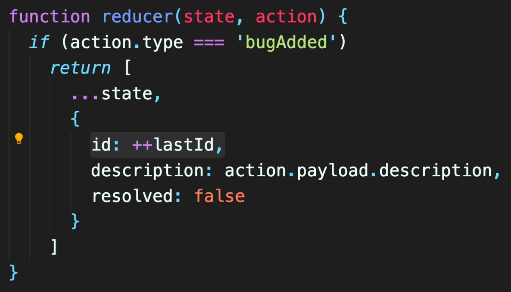
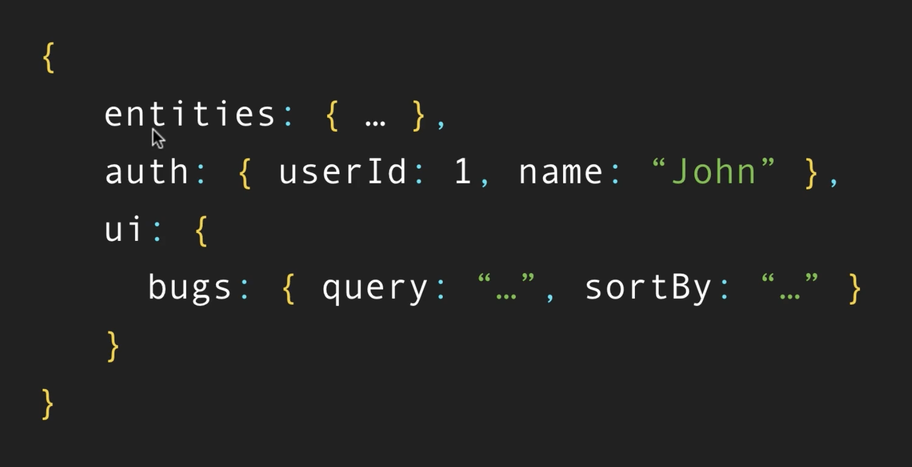

# Learning Redux

> Redux is used to **maintain a global state of application** in the browser. It can be used with React, Angular or Vue. To get the best out of it, use Redux with **Redux Toolkit** and **Redux DevTools**.
>
> 
>
> In this document, we will look at the following things -
>
> 1. Redux architecture
> 2. Steps for designing a Redux application
> 3. Structuring the Redux Store
> 4. Using the Redux Toolkit
> 5. Some key things about Redux
>    - Global vs All state
>    - Structuring a Redux store
>    - Combining Reducers
>    - Selectors
>    - Memoization
> 6. Middleware
> 7. Consumimg APIs
> 8. Testing Redux Apps
> 9. Integration with React

 

## 1. Redux architecture:

1. **Actions** : An application can send actions to store by calling the `dispatch()` method, whenever a user generates some event on the browser.
2. **Store** : Store takes the actions and dispatches them to reducers. The `getState()` method of store returns the latest state of the store. The `subscribe()` method is called whenever an event is dispatched.
3. **Reducers**: Reducers take actions and performs the necessary tasks to update the state of the store.

   

 

## 2. Steps for designing a Redux application:

- Below are the high-level steps for designing a Redux application

  

### 2.A. Design the store:

- A store can be designed to be a JavaScript object with multiple properties.

  

### 2.B. Define the actions

- An action is a JavaScript object with a `type` property. The value can be anything that is serializable.

  

### 2.C. Create a reducer

- Reducer is a function with two parameters - the current state and an action. Reducer returns the new state based on the action.

  

### 2.D. Set up the store

- A store is created using the `createStore()` method of redux which takes a reducer as an argument.

  

> **Note**:
>
> - Once all of these pieces are setup, actions can be dispatched from the App (`index.js` in our examples) by calling the `dispatch()` method from the store.
> - Below are the different properties of the store that can be accessed directly from the App.
>   .

 

## 3. Structuring the Redux store:

- Actions and reducers can be defined in separate files and folders. But a preferred way of storing actions & reducers is using the **_Ducks pattern_**. In this pattern, actions & reducers are defined in the same .js file.
- In the below file structure we can see there 3 different files are defined and kept under the store folder. Each individual file has its own actions and reducers.

  

 

## 4. Using the Redux Toolkit:

- Redux toolkit provides two methods - `createAction()` and `createReducer()` methods to create actions and reducers separately in different functions.
- Alternatively, redux-toolkit also provides `createSlice()` method which combines actions and reducers in a single function. This is a better option as defining action-types and mapping of action and reducer is done in one place. This provides a better code readability and maintainability.
- `createSlice()` method takes in 3 params -
  - **name** of the slice
  - **initialState** of the slice
  - **actions-reducers-map** : list of reducers in a key-value map of action(event) -> reducer(event-handler)

 

## 5. Some key things to know to design a Redux App

### 5.A. Global vs All (Local + Global) State

- To get the maximum benefit out of redux store all state information into redux except for form data. Below images shows the pros and cons and also the exception.

  
  

### 5.B. Structuring a Redux Store

- All individual application domain entities can be grouped under a single entities reducer. Similarly other aspects of the application like different ui related reducers, auth reducers, etc can be grouped along with the entities reducer in a single reducer which will be passed to the store.

  
  

### 5.C. Combining Reducers

- The store has access to the root reducer. Based on the type of the action, the same will be routed to the appropriate reducer.

  

### 5.D. Selectors

- Selector is a function, ideally defined in the same .js file where slices exist. It takes the current state from the store and returns a computed state out of it. It does not modify the state.

### 5.E. Memoization

- Memoization is a technique to fetch the state from cache if the same has not changed. There is a library called `reselect` that maintains a cache and we can write memoized selector using its `createSelector()` method. This is to improve the performance of our selector functions.

 

## 6. Middleware

 

## 7. Consuming APIs

 

## 8. Testing Redux Apps

 

## 9. Integration with React

 
 

# Project

## bugs app:

- The following actions are defined in the bugs app. In this project, we will create reducers for each of the defined actions and then dispatch those actions to the store from the app to update the state.
  

 

## References:

- [Redux Course](https://codewithmosh.com/p/ultimate-redux)
- [Redux Tutorial](https://redux.js.org/basics/basic-tutorial)
- [Redux Toolkit](https://redux-toolkit.js.org/tutorials/basic-tutorial)
- [React-Redux Guide](https://www.taniarascia.com/redux-react-guide)
